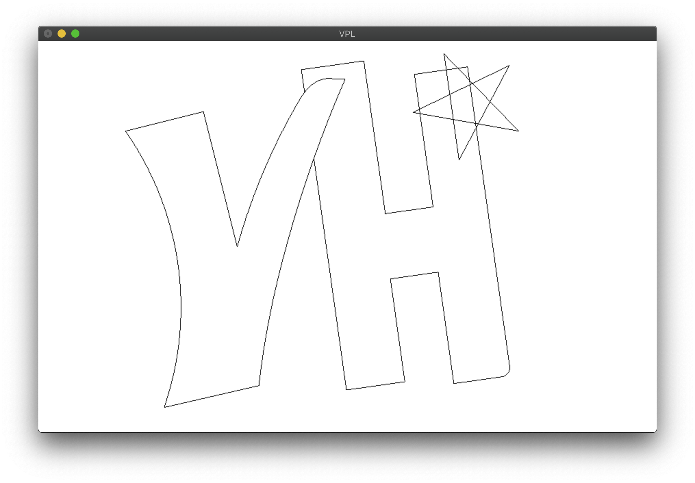
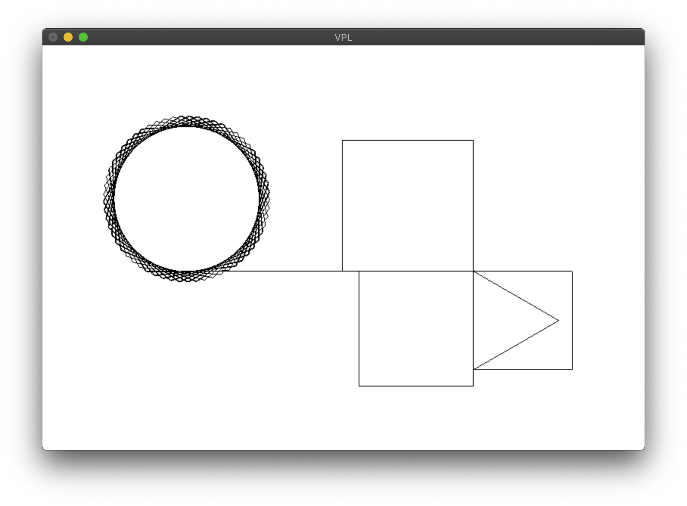

# VPL (Visual Programming Language)


VPL is a language initially developed at VandyHacks 2019, aiming to be
a _LOGO_-like language for the 21st century.

## Features
- Haskell-like syntax, using Unicode characters `○●↻↺↑` for base
  commands
- Lexical scoping
- Control constructs
  - Bounded loops with `loop`
  - `if` statements
- Procedures can be defined that take several numerical argument, and
  must be called with the correct number of arguments
- A `main` procedure must be defined to run a VPL program

## Sample
```haskell
-- Go forward: ↑
-- Clockwise, anti-clockwise rotation: ↻ ↺
-- Pen up, pen down: ○ ●

right = [ ↻ 90 ]
left  = [ ↺ 90 ]
-- Draw a square
□ n = [ loop 4 [↑ n, right]]
-- Draw a triangle
△ n = [ ↻ 30, ↑ n, ↻ 120, ↑ n, ↻ 120, ↑ n, right ]
main = [ ●, △ 60, □ 60, right, □ 70, right, □ 80, ↑ 150,
         loop 100 [↑ 50, ↻ 59]]
```

The above code generates the following image:


